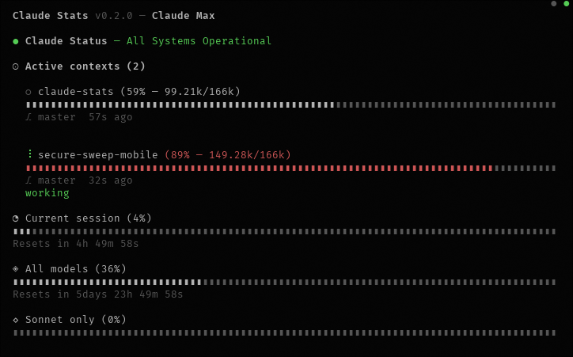

[](https://github.com/i-am-logger/claude-stats/releases/latest)
[](https://github.com/i-am-logger/claude-stats/actions/workflows/ci.yml)
[](https://creativecommons.org/licenses/by-nc-sa/4.0/)

# claude-stats

A TUI dashboard for monitoring Claude Code usage limits and active sessions.



## Features

- Live usage gauges for session, weekly (all models), Opus, and Sonnet limits
- Active session monitoring with context window utilization
- Subagent tracking with model, token count, and state
- Claude API status and incident display
- Auto-refreshes every 30 seconds
- Displays account email and plan type (Pro, Max, Team, Enterprise)
- Claude Code version display with update indicator
- Countdown timers showing when limits reset
- Color-coded warnings at 70% and 85% utilization
- Resource activity indicators (network, disk) and health status

## Install

```bash
cargo install --git https://github.com/i-am-logger/claude-stats
```

## Usage

```bash
claude-stats
```

Press `q` or `Esc` to quit.

Requires a valid Claude Code OAuth token in `~/.claude/.credentials.json`.

A [Nerd Font](https://www.nerdfonts.com/) is required for status line icons.

## Development

This project uses [devenv](https://devenv.sh/) for development environment management.

```bash
devenv shell
dev-run       # Run the application
dev-build     # Build the application
dev-test      # Run tests
```

## License

CC BY-NC-SA 4.0
